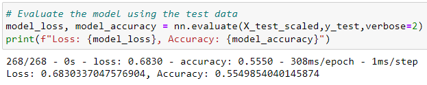

# Neural Network Charity Analysis

## Overview of the analysis

The goal of this analysis is to help the Alphabet Soup, a nonprofit foundation, to create a model that predicts which organizations are worth donating to and which are too high risk. A deep learning neural network was used for this purpose.

## Results

- Data Preprocessing step:
    - What variable(s) are considered the target(s) for your model?

        The target is our IS_SUCCESSFUL column, which contains information if the money used effectively (1) or not (0).

    - What variable(s) are considered to be the features for your model?

        The features are all other columns except of IS_SUCCESSFUL. Also columns EIN and NAME were dropped from the dataset.

        

    - What variable(s) are neither targets nor features, and should be removed from the input data?

        Columns EIN and NAME were dropped from the dataset since they were considered as non-beneficials.

        

- Compiling, Training, and Evaluating the Model:
    - How many neurons, layers, and activation functions did you select for your neural network model, and why?

        We used 2 layers, the firs one had 80 neurons, the second one 30 neurons. For hidden layers we used ReLU activation function and for the output layer it was Sigmoid.
        The Rectified Linear Unit (ReLU) function was used since it is the most used activation function in neural networks due to its simplifying output. For a classification model, we only want a yes or no binary decision. Therefore, we only need one output neuron and for our classification output, we used a sigmoid activation function to produce a probability output.

        

    - Were you able to achieve the target model performance?

        The target was to achieve an accuracy higher than 75%. But our model was able to achieve only 68.21%:

        

    - What steps did you take to try and increase model performance?

        Please see below few steps for model optimization.

### Steps for model optimization

***Step 1.*** Here I tried to remove additional columns from a dataset - columns STATUS and SPECIAL_CONSIDERATIONS. Also, Other group for CLASSIFICATION column was created with value counts less than 500 instead of 1500 in the original model. All other steps remain the same:

Unfortunately this gave us only 59.04% of accuracy:

***Step 2.*** Here I took the results from previous step with following changes: based on the rule of thumb (for a basic neural network is to have two to three times the amount of neurons in the hidden layer as the number of inputs) I changed the number of neurons, added third hidden layer:

This only decreased our accuracy to 55.50%:

***Step 3.*** Here I took the results from previous step just changing the activation function for the third layer to Sigmoid:

Again, this step decreased our accuracy - now it is 46.68%:

***Step 4.*** Since none of the above steps increased the accuracy let's try something else. Here I will bring back number of layers / features / activation functions as for original model. But in this step I'll remove only EIN column, all others will remain in the dataset. For NAMES column we'll bin to Others all with value counts less than 100.

All these modifications increased our accuracy to 72.36% - as a reminder, original model accuracy was 68.21%. This is still lower than the target value but already close:

Could it be that the NAME column only can help to increase the accuracy? Let's try the last step.

***Step 5.*** On the previous step we were able to increase the accuracy to 72.36%. I'm going to take it as it is with a small adjustment - this time for NAMES column we'll bin to Others all with value counts less than 50:

This gave us accuracy 73.17%:

## Summary

A deep learning neural network was able to achieve 73.17% of accuracy. Though it didn't get to the target performance of 75% it achieved better result rather than original model. We can also check the accuracy score with RandomForestClassifier - it gave us 71% predictive accuracy:

This is very close to what we were able to achieve with optimized model. So, since both of them were not able to achieve the target, and for both result was quite similar 71-73% we can use RandomForestClassifier since it doesn't require that much coding.